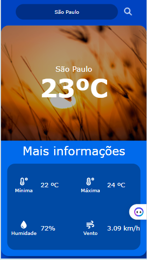
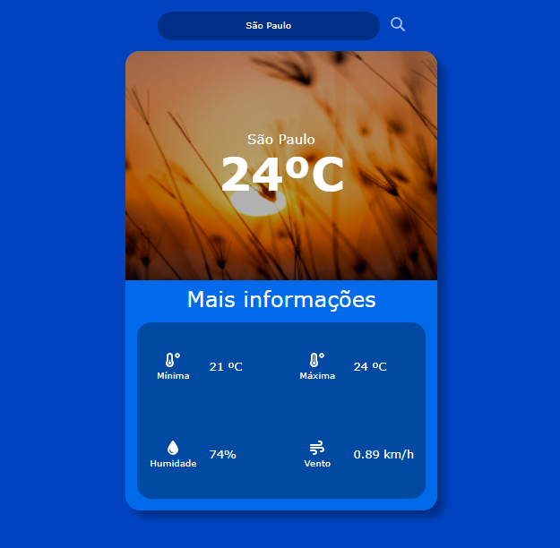

# WeatherApp🌦

## Index

- <a href="#imagens">Images the Project</a>
- <a href="#Demonstracao">Demonstration</a>
- <a href="#rodar">how to run the project?</a>
- <a href="#tecnologias">Technologies used</a>
- <a href="#Development server">Development server</a>
- <a href="#autor">Author</a>

### Images
Mobile



Desktop



## Demonstraçao

[Link demonstração]()

## how to run the project

```bash
# Clone este repositório
$ git clone linkrepo
# Acessa a pasta do projeto no seu teminal
$ cd Weather-app
# Instale as dependências
$ npm install
# Rodar a aplicação
$ ng server or ng s
```

## 🛠Technologies used

1. [html](https://developer.mozilla.org/pt-BR/docs/Web/HTML)
2. [css](https://developer.mozilla.org/pt-BR/docs/Web/CSS)
3. [javaScript](https://developer.mozilla.org/pt-BR/docs/Web/JavaScript)
4. [TypeScript](https://www.typescriptlang.org/)
4. [Angular - CLI 15.2.0](https://angular.io/cli)
4. [Weather API](https://openweathermap.org/api)

<div style="dislay: inline_block"> <br />
    
    
    
    
    
</div>

## Development server

Run `ng serve` for a dev server. Navigate to `http://localhost:4200/`. The application will automatically reload if you change any of the source files.

## Author


[](https://www.linkedin.com/in/emilio-jos%C3%A9-794955208/)


